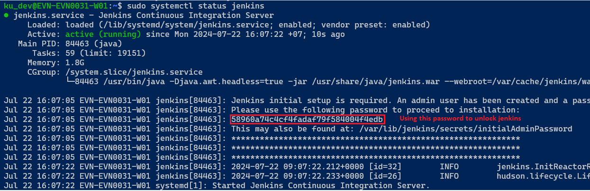
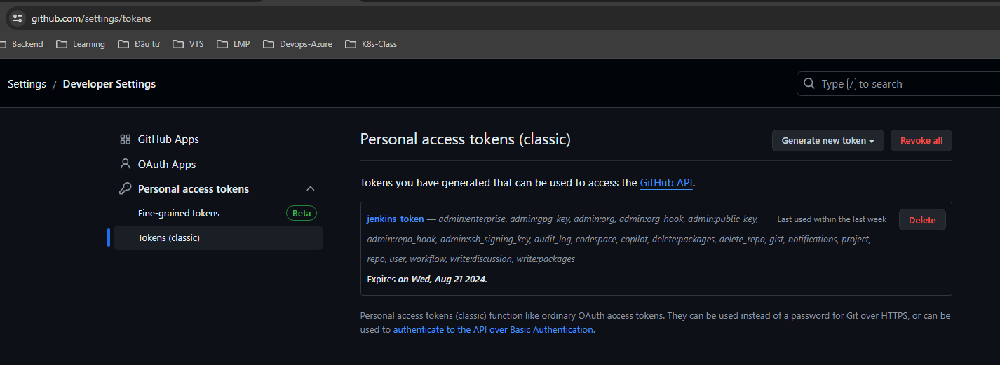
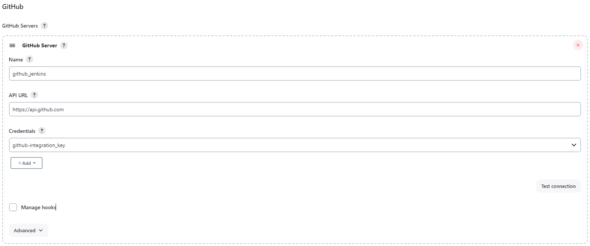
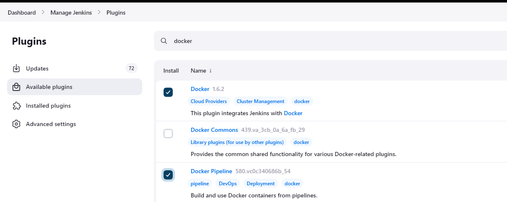

- [Install Jenkins](#install-jenkins)
  - [Check installation](#check-installation)
  - [Installation of Java](#installation-of-java)
- [Setup](#setup)
  - [Unlocks Jenkins](#unlocks-jenkins)
  - [Configure Github account](#configure-github-account)
    - [Generate developer personal access token](#generate-developer-personal-access-token)
    - [Config github account with jenkins](#config-github-account-with-jenkins)
      - [Go to: Manage Jenkins \> System \> Go to Git hub](#go-to-manage-jenkins--system--go-to-git-hub)


# Install Jenkins

[Install jenkins link on linux](https://www.jenkins.io/doc/book/installing/linux/)

```bash
sudo wget -O /usr/share/keyrings/jenkins-keyring.asc \
  https://pkg.jenkins.io/debian-stable/jenkins.io-2023.key
echo "deb [signed-by=/usr/share/keyrings/jenkins-keyring.asc]" \
  https://pkg.jenkins.io/debian-stable binary/ | sudo tee \
  /etc/apt/sources.list.d/jenkins.list > /dev/null
sudo apt-get update
sudo apt-get install jenkins
```

## Check installation 

```code
1. Setup Jenkins as a daemon launched on start: systemctl cat jenkins
2. If have troubleshooting Jenkins: journalctl -u jenkins.service
3. Set Jenkins to listen on port 8080. Access this port with your browser to start configuration. 
If Jenkins fails to start because a port is in use, run systemctl edit jenkins and add the following: 

systemctl edit jenkins

[Service]
Environment="JENKINS_PORT=8081"

```

## Installation of Java
Jenkins requires Java to run, yet not all Linux distributions include Java by default. Additionally, not all Java versions are compatible with Jenkins.

```bash
sudo apt update
sudo apt install fontconfig openjdk-17-jre
java -version
openjdk version "17.0.8" 2023-07-18
OpenJDK Runtime Environment (build 17.0.8+7-Debian-1deb12u1)
OpenJDK 64-Bit Server VM (build 17.0.8+7-Debian-1deb12u1, mixed mode, sharing)
```

# Setup
## Unlocks Jenkins




## Configure Github account

[How To Set Up Continuous Integration With Git and Jenkins](https://www.lambdatest.com/blog/how-to-setup-continuous-integration-with-git-jenkins/)


### Generate developer personal access token



### Config github account with jenkins

#### Go to: Manage Jenkins > System > Go to Git hub



## Install jenkins docker plugins



